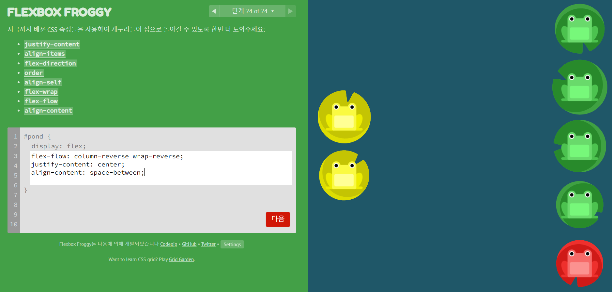

# FLEXBOX FROGGY

## flex 요소 습득을 위한 웹 사이트

### 1. justify-content: 요소들을 가로선 상에서 정렬

- flex-start: 요소들을 컨테이너의 왼쪽으로 정렬합니다.
- flex-end: 요소들을 컨테이너의 오른쪽으로 정렬합니다.
- center: 요소들을 컨테이너의 가운데로 정렬합니다.
- space-between: 요소들 사이에 동일한 간격을 둡니다.
- space-around: 요소들 주위에 동일한 간격을 둡니다.

### 2. align-items: 요소들을 세로선 상에서 정렬

- flex-start: 요소들을 컨테이너의 꼭대기로 정렬합니다.
- flex-end: 요소들을 컨테이너의 바닥으로 정렬합니다.
- center: 요소들을 컨테이너의 세로선 상의 가운데로 정렬합니다.
- baseline: 요소들을 컨테이너의 시작 위치에 정렬합니다.
- stretch: 요소들을 컨테이너에 맞도록 늘립니다.

### 3. flex-direction: 컨테이너 안에서 요소들이 정렬해야 할 방향을 지정

- row: 요소들을 텍스트의 방향과 동일하게 정렬합니다.
- row-reverse: 요소들을 텍스트의 반대 방향으로 정렬합니다.
- column: 요소들을 위에서 아래로 정렬합니다.
- column-reverse: 요소들을 아래에서 위로 정렬합니다.

### 4. order: 기본 값은 0이며, 양수나 음수로 바꿀 수 있음, 각 요소에 순서 적용

### 5. align-self: align-items가 사용하는 값들을 인자로 받으며, 그 값들은 지정한 요소에만 적용

### 6. flex-wrap: 한줄에 넘치는 요소를 다음줄에 넘길지 지정

- nowrap: 모든 요소들을 한 줄에 정렬합니다.
- wrap: 요소들을 여러 줄에 걸쳐 정렬합니다.
- wrap-reverse: 요소들을 여러 줄에 걸쳐 반대로 정렬합니다.

### 7. align-content: 여러 줄 사이의 간격을 지정

- flex-start: 여러 줄들을 컨테이너의 꼭대기에 정렬합니다.
- flex-end: 여러 줄들을 컨테이너의 바닥에 정렬합니다.
- center: 여러 줄들을 세로선 상의 가운데에 정렬합니다.
- space-between: 여러 줄들 사이에 동일한 간격을 둡니다.
- space-around: 여러 줄들 주위에 동일한 간격을 둡니다.
- stretch: 여러 줄들을 컨테이너에 맞도록 늘립니다.

