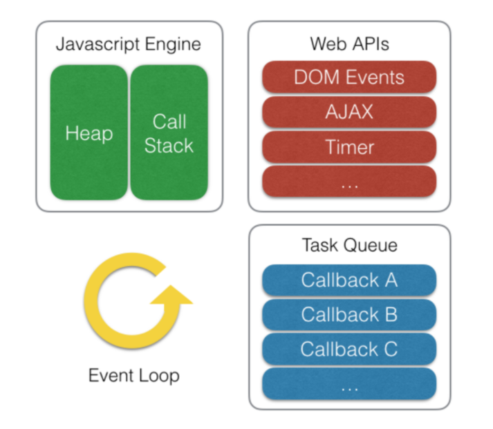

# Jquery
- Js의 라이브러리
- js를 편리하게 사용하기 위한 언어
- 달러 표시이용하여 코드 간결

# 부트스트랩
- CSS다루는 프레임워크

# Ajax
- Asynchronous Javascript and XML (비동기식 자바스크립트와 XML)
- XMLHttpRequest
- js의 라이브러리
- 전체 페이지 새로 고치지 않고 페이지 일부만을 위해 데이터 로드하는 기법
- js를 이용한 비동기 통신
- client - server간 JSON, XML 형태의 데이터 주고받는 기술
- 형식
<pre>
<code>
$.ajax({
    url: "", //요청url
    type: 'POST'/'GET' //데이터를 post / get 방식으로 전송 후 응답 받는 경우
    data: data, //요청과 함께 서버로 전송할 string / map
    contentType: 'application/json', // default는 apllication/x-www-form-urlencodede; charset=UTF-8
    dataType:'json'/'text'... ,// 서버에서 전송받은 데이터 형식
    async: true, //default는 비동기식의 true, false로 설정시 동기식
    success: function(res){},
    error: function(err){}
});

$.each(data, function(idx, item)) // jquery의 반복문
</code>
</pre>
# JSON
- js의 객체 만드는 표현식
- key, value로 구성, 경량의 data 교환하는 방식
# 동기 / 비동기
### 동기
- 어떤 일을 수행하는 중에는 다른 일 수행 불가
- 요청 후 응답받아야 다음 동작가능
- 설계간단, 직관적
- 시스템 효율 저하
### 비동기
- 어떤 일을 수행하면서 다른 일도 같이 수행하는 것
- 동기방식보다 복잡
- 자원 효율적 사용가능
# Callback Function
- 특정 함수가 실행 마친 뒤 실행되는 함수
- ex) 비동기 데이터 처리위해 다른 함수 실행 끝날 때 까지 특정 코드 수행 대기
# 이벤트 루프
- 웹 브라우저에서 사용되는 기능 중 하나
- callback event queue에서 하나씩 꺼내 동작시키는 loop
- js는 싱글 스레드로 그 자체로 비동기 작업 불가하나 웹 브라우저 도움받아 구현
- js : 하나의 메인 스레드와 하나의 콜스택가지고 있다는 관점에서 싱글 스레드

#### 출처 : https://zereight.tistory.com/855
- 이벤트 발생 시 호출되는 콜백함수들을 task queue에 전달, task queue에 담긴 콜백 함수들을 콜 스택에 넘김
- 콜스택에 넘겨주는 작업은 콜스택에 쌓여있는 함수 없을 때만 수행
- task queue : web api에서 비동기 작업 실행 후 호출되는 콜백함수 대기 공간, FIFO, 여러개의 queue로 구성
- web api : 브라우저에서 자체 지원하는 api, DOM event, AJAX, setTimeout 등 비동기 작업 수행 지원
### 런타임환경에서 비동기 코드 실행과정
- 코드가 호출스택에 쌓인 후 실행 시 js엔진이 비동기작업을 web api에 위임
- web api는 해당 비동기 작업 수행, 콜백함수를 이벤트루프 통해 task queue에 넘김
- 이벤트 루프는 콜스택에 쌓인 함수가 없을 때 task queue에서 대기하던 콜백함수를 콜스택으로 전달
- 콜스택에 쌓인 콜백함수 실행, 콜스택에서 제거
# DOM
- Document of Model
